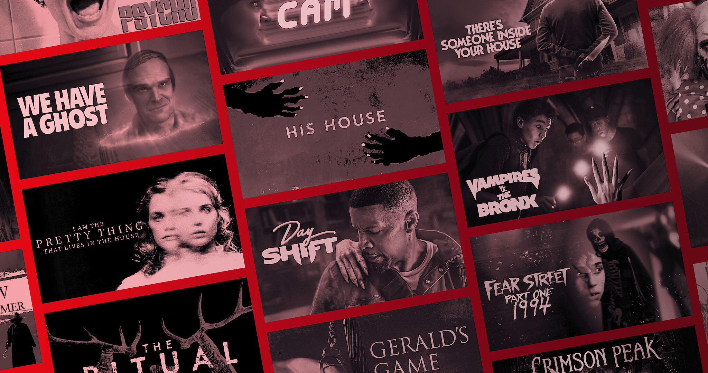
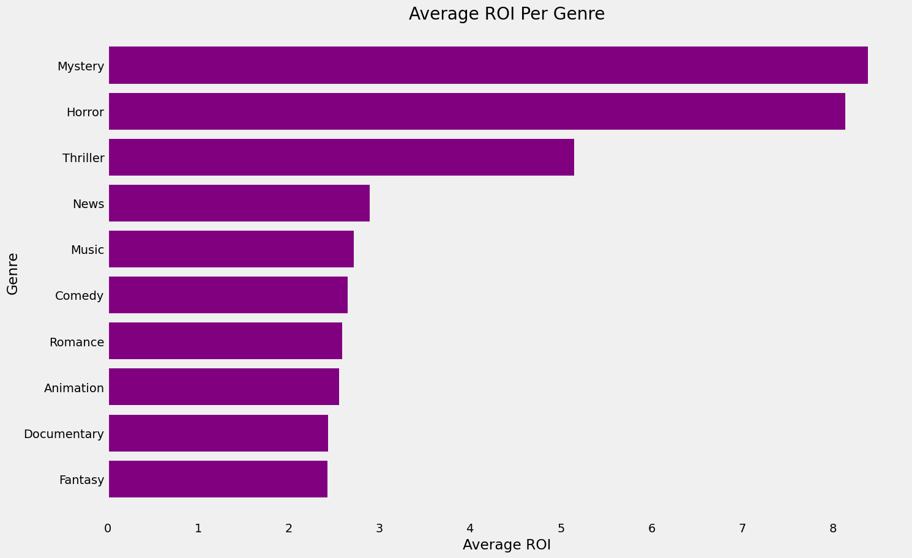

## Phase_2_Movie_Project

# 3D-Films: Scary Secrets Of The Film Industry 

# Overview
3D-Films conducted an in-depth review of movie data in order to provide informed advice to a prospective new entrant into the film industry. We parsed through box office numbers, film ratings, personnel, and genre representation to determine an optimized approach to building a cinematic empire. After conducting our analysis, we have determined that the strongest correlation for production budget to profit occurs in the highest tier of budget allocation, but there are some competitive impediments to operating at those budget levels as a new company. Fortunately, all budget tiers were profitable on average. Secondly, we also determined that the Horror genre is an ideal genre for producing cost-effective films with a great track ROI track record. Our third insight is that using buzz-worthy personnel is useful for cultivating buzz and excitement amongst the public.

# Business Problem
A company approached 3D-Films asking for business insights and advice about the film industry. Our clients hope to compete with current industry leaders and other large companies who have recently entered the media business. We were tasked with finding three actionable insights to help make their entry to the business as impactful as possible.

# Success: 
We’ve set profitability or high investment return and high reviews as a metric of success in the film industry
>- What production budget yields high return?
>- What genre and release date?
>- And which creative personnel?

# Data Understanding
We parsed through several different sources of data. Our data was taken from a number of sites that track the movie industry. The data contained a tremendous amount of information including information regarding box office revenue, production budgets, release dates, and reviews from critics and regular people as well. We put profit first in our analysis, and then provided options to pursue depending on the clients' preferred budget, genre, or critical appeal.

# Production Budget

The first element we examined was the correlation between budget size and earnings profiles. We first divided the data into four separate budget groups, and evaluated each tier's descriptive statistics. We also constructed simple linear regression models in order to determine how predictable and explainable the relationship between budget size and earnings potential is.

# Genres And Release Date 

We conducted an analysis of genres based on ROI and identified the top 10 genres.

At the end of the analysis, we found that the Mystery, Horror, and Thriller genres were the top three genres based on ROI. Therefore, we have decided to conduct further analysis on these genres. As a first step, we analyzed the release months for each season based on ROI for each genre. Our observations revealed that the Summer, Halloween, and Winter holiday seasons appear to be the potentially best seasons in terms of ROI for horror movies. However, we also noted that the Summer and Halloween seasons are highly competitive and risky for a company new to the film industry. As a result, we recommend targeting the Winter holiday season, particularly with January releases, as a more favorable option for Horror/Thriller/Mystry Genres. 

# Personnel 
We analyzed if there was a relationship between ratings and profit, and we found a moderate positive correlation of 31%.
We therefore used this to further check which artists are associated with high ratings and ROI. We found the following results:

## Best Directors for the Horror/Thriller/Mystry Genre
>- David Fincher
>- John Madden
>- Kathryn Bigelow
>- Derek Cianfrance
>- Oliver Stone

## Best Writers for the Horror/Thriller/Mystry Genre
>- Stephen King
>- Dario Argento
>- Phil Hay
>- John Carpenter
>- Colin Bateman

## Best Actor/Actress for the Horror/Thriller/Mystry Genre
>- Leonardo DiCaprio
>- Natalie Portman
>- Ben Affleck
>- Tom Hanks
>- Gary Oldman
>- Javier Bardem
>- Matthew Goode
>- Lili Taylor
>- Forest Whitaker
>- Samuel L. Jackson
>- Sandra Bullock
>- Ewan McGregor
>- Harrison Ford
>- Sean Bridgers
>- Catherine Keener

# Conclusion

Based on our analysis, we have found that expenditure had strong correlation with profit. High budget movies had the highest returns in comparison to those with low budget, but some the studios that operate in that stratosphere have substantial competitive moats. 

We de looked deeper into genres, low-budget horror and mystery movies tend to yield the highest return on investment (ROI).

Considering the financial risks associated with high-budget films, we recommend that a new film studio focuses on producing low to mid budget horror/thriller and mystery movies. By starting with these genres, the studio can minimize financial risks while still capitalizing on the high ROI potential the genre offers. This approach allows the studio to gain experience and establish a foothold in the industry before venturing into more expensive projects. This conclusion is based on the data we have examined, which indicates that these genres have a strong potential for profitability.

It is important to note that our analysis is based on the available data and industry trends. The success of any movie project depends on various factors, including marketing strategies, storytelling, and audience reception. However, by focusing on low-budget horror and mystery movies and aligning their release with the Halloween season especially to avoid competition with established studios releasing in the summer, a new film studio can increase their chances of achieving a higher ROI. Aiming for writers, directors, actors and actresses that are associated with movies with highest ratings is also a good strategy to maximize popularity and establish a strong presence in the industry.

